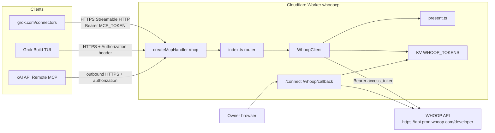
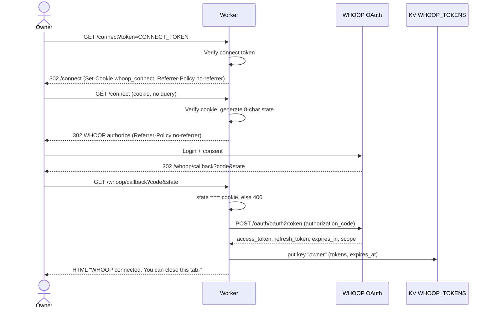
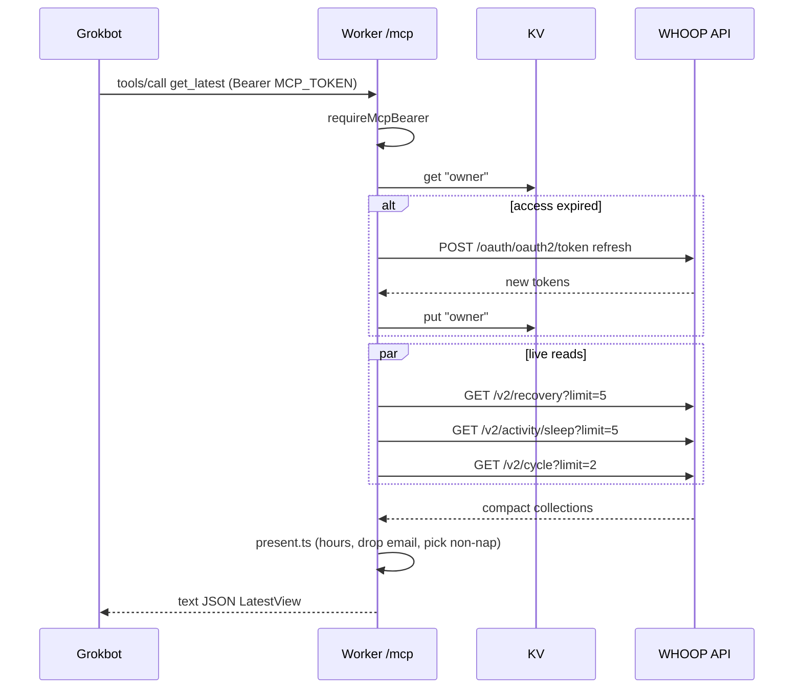

# whoopcp: Remote MCP Server for Personal WHOOP Coaching

| Field | Value |
| --- | --- |
| **Title** | whoopcp — Cloudflare Worker MCP over WHOOP v2 |
| **Author** | TBD |
| **Date** | 2026-08-25 |
| **Status** | Draft (open questions resolved) |
| **Repo** | this repository (TypeScript Worker) |
| **Audience** | Senior engineers implementing and reviewing the Worker |

---

## Overview

whoopcp is a single-tenant, read-only [Model Context Protocol](https://modelcontextprotocol.io) server that exposes one person's WHOOP recovery, sleep, strain, and workout data to a coach Grokbot. The Worker is a thin coach-oriented API over the official WHOOP v2 REST API. It does not generate training plans, write to WHOOP, or store health payloads. Coaching logic lives entirely in Grok.

The server is hosted as a **stateless Cloudflare Worker** on the free tier, using Streamable HTTP at `/mcp`. The owner authorizes WHOOP once in a browser (`/connect` → `/whoop/callback`); tokens live in Workers KV. Grok clients authenticate to `/mcp` with a static bearer secret. Primary client is a grok.com custom connector; Grok TUI and xAI API use the same URL. Seven tools hide pagination, convert units, and assemble calendar days so the model is not handed raw WHOOP JSON.

---

## Background & Motivation

Grok can coach from recovery, sleep, strain, and workouts only if it can fetch them over a publicly reachable MCP transport. **Primary client is grok.com** (custom connector). Same Worker URL also serves Grok TUI and xAI API:

1. **grok.com/connectors** (primary) — Custom connector, paste `https://whoopcp.<account>.workers.dev/mcp`. README and post-deploy smoke test lead here. Keep `/mcp` behind `MCP_TOKEN`. If the connector UI cannot send a bearer header, do **not** open `/mcp`; that is a v1.1 MCP OAuth-provider follow-up. TUI and xAI still work.
2. **Grok Build TUI** — remote HTTP MCP with an `Authorization` header. Tools appear as `whoop__<tool>`. Default tool-result truncation is **20,000 bytes**.
3. **xAI API Remote MCP** — `mcp(server_url=..., authorization=...)`. xAI servers connect outbound; only Streamable HTTP and SSE are supported. stdio is not reachable.

A local stdio MCP with stored WHOOP tokens works for a laptop Claude/Grok TUI stdio client and fails for (1) and (3). The Worker must be public HTTPS.

WHOOP's API is not coach-shaped. Collections are paginated (`limit` max 25, `nextToken`), times are UTC with a per-record `timezone_offset`, durations are milliseconds, and a **physiological cycle is sleep-to-sleep, not a calendar day**. Dumping 1:1 REST wrappers burns model context, hits Grok's 20 KB truncation, and wastes the 100 req/min WHOOP budget. The MCP should offer a handful of assembled tools.

The repo is empty. This document is the implementation contract for a new TypeScript Cloudflare Worker named `whoopcp`.

---

## Goals & Non-Goals

### Goals

- Deploy a public Streamable HTTP MCP endpoint on Cloudflare Workers free tier (`*.workers.dev`).
- Support grok.com custom connectors as the primary client, plus Grok TUI remote HTTP and xAI API Remote MCP, on one URL.
- One-time WHOOP OAuth for a single owner; automatic access-token refresh.
- Seven coach tools (see [Tool Catalog](#tool-catalog)): profile, latest snapshot, calendar day, three lists, range summary.
- Compact, unit-converted JSON well under Grok TUI's 20 KB truncation.
- Read-only. No write scopes, no Trusted Partner / lab APIs, no continuous HR (WHOOP does not expose samples).
- Independently reviewable PRs as listed in [PR Plan](#pr-plan).

### Non-Goals (v1)

- Multi-athlete SaaS, per-coach ACL, or team dashboards. Single-user only (owner’s WHOOP).
- Full MCP OAuth authorization server (`workers-oauth-provider`, GitHub, Cloudflare Access) in v1. v1.1 only if grok.com cannot send a bearer header.
- Caching WHOOP payloads, D1/Postgres sync, or webhooks.
- Generating workouts, periodization, or nutrition plans (Grok does that).
- stdio transport, Durable Object / `McpAgent` sessions, elicitation, sampling, or subscriptions.
- Write tools, webhook receivers, calendar MCP resources, or get-by-id tools.
- Native IANA timezone database and any `OWNER_TZ` Wrangler var. v1 uses each record’s WHOOP `timezone_offset` (fixed offset, not DST-aware historical zones).

---

## Key Decisions

| Decision | Choice | Rationale |
| --- | --- | --- |
| Hosting | Cloudflare Workers free tier + KV, `whoopcp.<account>.workers.dev` | Official remote MCP path, HTTPS, 100k req/day, $0. Load is a few dozen tool calls per coaching session. VPS is fallback only. |
| MCP handler | Stateless `createMcpHandler` from `agents/mcp/server` + `@modelcontextprotocol/server` v2 | Cloudflare: new servers must not use deprecated `McpAgent` / Durable Object MCP. Canonical example: [cloudflare/agents/examples/mcp-worker](https://github.com/cloudflare/agents/tree/main/examples/mcp-worker). |
| Transport | Streamable HTTP at `/mcp` | Required by xAI Remote MCP and grok.com. SSE is acceptable to xAI but Streamable HTTP is the Workers default. stdio cannot serve xAI's outbound client. |
| Tenancy | Single WHOOP identity in one KV key (`owner`) | Owner’s WHOOP only. Do not design multi-athlete now. |
| WHOOP developer app | Owner creates the app before PR 3 can be verified live | No existing app. Team, scopes, and redirect URIs (prod + localhost) are an owner blocker, not skippable in code. |
| Primary client | grok.com custom connector | README and smoke test lead with grok.com. Same URL for Grok TUI and xAI API. |
| WHOOP auth | Authorization code + `offline` refresh, tokens in KV | Browser one-time setup. Worker refreshes on expiry/401. Confidential client (secret stays on the Worker). |
| MCP auth | Static bearer `MCP_TOKEN` on `/mcp` from the first MCP deploy (PR 2) | Required even for grok.com. If grok.com’s UI cannot send a bearer header, do **not** open `/mcp` — v1.1 MCP OAuth-provider follow-up; TUI/xAI remain the working paths. Unset `MCP_TOKEN` is localhost-only; production fail-closed. |
| Connect gate | `CONNECT_TOKEN` (fallback: `MCP_TOKEN`) on `/connect`; token never rides the 302 to WHOOP | Prevents a stranger from rebinding the Worker. Query token is swapped for a short-lived cookie (or POST body) before the authorize redirect. `Referrer-Policy: no-referrer` on that 302. Callback is protected by OAuth `state`, not bearer. |
| Tool surface | 7 assembled tools, not 1:1 REST | Fits model context, hides pagination, converts units, explains cycle vs calendar day. |
| Data path | Live WHOOP fetch, no payload cache | Rate limits (100/min, 10k/day WHOOP; 50 subrequests/invocation Worker free) are enough. Caching+webhooks are a later optimization. |
| Output | Compact JSON text, milliseconds → hours/minutes, no `nextToken`, no email | Grok TUI truncates at 20 KB. Health data minimization. |
| Timezone | Each record’s WHOOP `timezone_offset` | No IANA zone, no `OWNER_TZ` var in v1. Date windows (`get_day`, list ranges) use the latest cycle’s offset unless the tool arg is a WHOOP TZD (`+hh:mm` / `-hh:mm` / `Z`). |
| `get_profile` body | Always include height, weight, max HR. No `include_body` flag | Smaller tool schema. Email is still never returned. |
| Strain in summaries | Page `/v2/cycle` for day strain; workouts for sport breakdown | Workout strain does not equal WHOOP day strain. Deliberate extra collection vs a naïve "three collections" summary. |
| `get_latest` cycles | `current_cycle` = collection row 0; `latest_scored_cycle` if that row is not `SCORED` | Mirrors recovery. Overwriting `current_cycle` with yesterday’s scored cycle would report the wrong day’s strain. |
| Recovery bands | Red `score < 34`, yellow `34–66` inclusive, green `>= 67` | WHOOP 0–33 / 34–66 / 67–100. Score 33 is red. |

---

## Proposed Design

### Hosting: Cloudflare Workers free tier

**Default: Workers + KV. VPS only if Cloudflare account, OAuth redirect, or Workers limits block us.**

| Limit | Free tier (2026) | whoopcp usage |
| --- | --- | --- |
| Requests | 100,000 / day, 1,000 / min | One coach, tens of calls/session |
| CPU time | 10 ms **CPU** per invocation (I/O excluded) | JSON map of ≤200 records is well under 10 ms. `fetch()` to WHOOP does not count. |
| Subrequests | 50 external / invocation; 1,000 to KV | Worst tool (`summarize_range`, 90 days) ≈ 16–26 WHOOP GETs. Cap 8 pages × 4 collections + 1 refresh. |
| Simultaneous outgoing connections | 6 / request | Parallelize the 3–4 collection fetches; page sequentially within each. |
| KV | 100k reads/day, 1k writes/day, 1 write/sec/key | One read per tool call; writes only on OAuth and refresh (~hourly). |
| Duration | No wall-clock limit while the client is connected | Do not `sleep` on long `Retry-After`; fail fast. |
| HTTPS / URL | Free `*.workers.dev` | `https://whoopcp.<account>.workers.dev/mcp` |

If CPU Error 1102 appears on `summarize_range`, upgrade that Worker to paid ($5/mo) before considering a VPS. Paid also raises subrequests; we do not need that for v1.

**Do not** use Vite/SPA assets from the mcp-worker example. whoopcp is a pure Worker (`src/index.ts`). No Durable Objects, no `McpAgent`.

### Repo layout

```
whoopcp/
  wrangler.jsonc
  package.json
  tsconfig.json
  .dev.vars.example
  src/
    index.ts          # fetch router: /mcp, /connect, /whoop/callback, /disconnect, /health
    mcp.ts            # createWhoopServer(env) factory + tool registration
    auth.ts           # MCP bearer + connect-token checks
    whoop/
      client.ts       # fetch wrapper, pagination, 401 refresh, 429
      oauth.ts        # authorize URL, code exchange, refresh, revoke
      tokens.ts       # KV get/put for the single owner
      types.ts        # WHOOP v2 types actually used
      present.ts      # compact coach-facing records + unit conversion
      day.ts          # calendar-day assembly
      summarize.ts    # range aggregates
  README.md           # owner setup: WHOOP app, secrets, Grok clients
```

### Dependencies

Install the versions required by the installed Agents release (Cloudflare: pin `@modelcontextprotocol/server` to what that Agents version ships):

```bash
npm i agents @modelcontextprotocol/server@2.0.0 zod
npm i -D wrangler typescript @cloudflare/workers-types
```

`package.json` scripts: `"dev": "wrangler dev"`, `"deploy": "wrangler deploy"`, `"types": "wrangler types"`.

### wrangler.jsonc

```jsonc
{
  "$schema": "node_modules/wrangler/config-schema.json",
  "name": "whoopcp",
  "main": "src/index.ts",
  "compatibility_date": "2026-08-25",
  "compatibility_flags": ["nodejs_compat"],
  "kv_namespaces": [
    {
      "binding": "WHOOP_TOKENS",
      "id": "<prod-namespace-id>",
      "preview_id": "<preview-namespace-id>"
    }
  ],
  "vars": {
    "WHOOP_REDIRECT_URI": "https://whoopcp.<account>.workers.dev/whoop/callback"
  }
}
```

Local redirect is **not** in `vars`; it comes from `.dev.vars`:

```
WHOOP_CLIENT_ID=...
WHOOP_CLIENT_SECRET=...
MCP_TOKEN=...
CONNECT_TOKEN=...
WHOOP_REDIRECT_URI=http://localhost:8787/whoop/callback
```

Production secrets (`wrangler secret put`): `WHOOP_CLIENT_ID`, `WHOOP_CLIENT_SECRET`, `MCP_TOKEN`, `CONNECT_TOKEN`.

`Env`:

```ts
interface Env {
  WHOOP_TOKENS: KVNamespace;
  WHOOP_CLIENT_ID: string;
  WHOOP_CLIENT_SECRET: string;
  MCP_TOKEN: string;
  CONNECT_TOKEN?: string;
  WHOOP_REDIRECT_URI: string;
}
```

Create KV: `npx wrangler kv namespace create WHOOP_TOKENS` (and `... --preview` for `preview_id`).

### Request routing (`src/index.ts`)

One object default export. Do **not** export the MCP handler function as `default` (Wrangler treats function defaults as `WorkerEntrypoint`).

| Path | Auth | Behavior |
| --- | --- | --- |
| `GET /health` | none | `{ ok: true, whoop_connected: boolean }` — no tokens, no email |
| `GET /connect` | none (form) or `whoop_connect` cookie | No token: HTML form (`POST /connect`). Cookie: start OAuth (see [Connect token handling](#connect-token-handling)). |
| `GET /connect?token=` | `CONNECT_TOKEN` or `MCP_TOKEN` | Validate, set `whoop_connect` cookie, **302 to `/connect` with no query** so the secret leaves the address bar before WHOOP |
| `POST /connect` | token in form body (preferred) | Same as cookie path: CSRF cookie + 302 to WHOOP |
| `GET /whoop/callback` | OAuth `state` cookie | code exchange, KV put, HTML success |
| `POST /disconnect` | connect cookie, form token, or `?token=` (same gate as `/connect`) | `DELETE https://api.prod.whoop.com/developer/v2/user/access` + KV delete |
| `OPTIONS /mcp` | none | Pass through to `createMcpHandler` (CORS preflight has no `Authorization`) |
| `GET`/`POST /mcp` | `Authorization: Bearer <MCP_TOKEN>` | `createMcpHandler(() => createWhoopServer(env), { route: "/mcp" })` |
| `GET /` | none | Short plaintext: service name, `/health`, `/connect` (no secrets, no tool list) |
| other | — | `404` |

Bearer check is timing-safe (`crypto.subtle.timingSafeEqual` on SHA-256 of both sides, or `crypto.subtle.verify` with an HMAC compare). On `GET`/`POST` `/mcp`, reject missing/invalid with `401` and `WWW-Authenticate: Bearer`. **Do not** run `requireMcpBearer` on `OPTIONS /mcp` — browser preflight has no `Authorization`, and a 401 would block `createMcpHandler`’s CORS headers.

`MCP_TOKEN` policy:

- **Set** (production and typical local): required on every non-OPTIONS `/mcp` request.
- **Unset on localhost** (`hostname` is `localhost` or `127.0.0.1`): skip bearer so `wrangler dev` can omit it in `.dev.vars`. Document this as a local-only escape.
- **Unset on any other host** (including `*.workers.dev`): fail closed — `503` `MCP_TOKEN not configured`. Never serve `/mcp` open on a public URL.

`/mcp` CORS: leave `createMcpHandler` default wildcard CORS so MCP inspector and browser connectors work. CORS is not authentication.

Factory must close over `env` from the current `fetch`:

```ts
export default {
  async fetch(request: Request, env: Env, ctx: ExecutionContext): Promise<Response> {
    const url = new URL(request.url);
    if (url.pathname === "/health") {
      return health(env);
    }
    if (url.pathname === "/connect") {
      return startConnect(request, env);
    }
    if (url.pathname === "/whoop/callback") {
      return handleCallback(request, env);
    }
    if (url.pathname === "/disconnect") {
      return disconnect(request, env);
    }
    if (url.pathname === "/mcp") {
      if (request.method !== "OPTIONS") {
        const denied = requireMcpBearer(request, env);
        if (denied) {
          return denied;
        }
      }
      return createMcpHandler(() => createWhoopServer(env), { route: "/mcp" })(
        request,
        env,
        ctx,
      );
    }
    if (url.pathname === "/") {
      return new Response("whoopcp — personal WHOOP MCP\n/health\n/connect\n", {
        headers: { "content-type": "text/plain; charset=utf-8" },
      });
    }
    return new Response("Not found", { status: 404 });
  },
} satisfies ExportedHandler<Env>;
```

Pass the factory, not a pre-built `McpServer`. Handler creates one server per request (stateless protocol).

### MCP server factory (`src/mcp.ts`)

```ts
import { McpServer } from "@modelcontextprotocol/server";
import { z } from "zod";

export function createWhoopServer(env: Env): McpServer {
  const server = new McpServer({ name: "whoopcp", version: "1.0.0" });
  const whoop = new WhoopClient(env);

  server.registerTool("get_profile", { description, inputSchema }, handler);
  // ... seven tools

  return server;
}
```

Every tool:

1. Calls `whoop` (live fetch).
2. Runs `present.ts` (compact records).
3. Returns MCP text JSON:

```ts
function ok(data: unknown) {
  return {
    content: [{ type: "text" as const, text: JSON.stringify(data) }],
  };
}

function fail(message: string) {
  return {
    isError: true,
    content: [{ type: "text" as const, text: message }],
  };
}
```

Do not return raw WHOOP envelopes. Do not include `next_token`. Soft cap serialized text at **18,000** characters; if over, set `truncated: true` and drop oldest list rows until under cap (keep aggregates). Hard reason: Grok TUI truncates at 20,000 bytes.

Server instructions / each tool `description` must tell the model **when to call** which tool (see catalog).

---

### Architecture



---

### WHOOP OAuth sequence

WHOOP is a confidential-client authorization-code flow. Request `offline` to receive refresh tokens. **Do not use PKCE** unless WHOOP later requires it; the Worker holds `WHOOP_CLIENT_SECRET`.

WHOOP URLs (do not invent others):

| Purpose | URL |
| --- | --- |
| Authorize | `https://api.prod.whoop.com/oauth/oauth2/auth` |
| Token | `https://api.prod.whoop.com/oauth/oauth2/token` |
| API base | `https://api.prod.whoop.com/developer` |
| Dashboard | https://developer-dashboard.whoop.com/apps/create |

Scopes (space-separated, all read + offline; no write):

```
offline read:recovery read:cycles read:workout read:sleep read:profile read:body_measurement
```

WHOOP requires the redirect URI to match the dashboard **exactly**. Register both:

- Production: `https://whoopcp.<account>.workers.dev/whoop/callback`
- Local: `http://localhost:8787/whoop/callback`

WHOOP documents that a self-generated `state` **must be eight characters**. Generate 8 url-safe chars (`A-Za-z0-9_-`). Store it in an HttpOnly cookie (not KV) so `/connect` does not spend a KV write:

```
Set-Cookie: whoop_oauth_state=<8chars>; Path=/; HttpOnly; Max-Age=600; SameSite=Lax
```

Add `Secure` only when the request URL is `https:`. Local `wrangler dev` is HTTP.

#### Connect token handling

Do **not** 302 to WHOOP while `?token=` is still on the Worker URL. Browsers may send `Referer: https://whoopcp…/connect?token=…` to `api.prod.whoop.com`. Query tokens also linger in history and some access logs.

Preferred (token never in the address bar):

1. `GET /connect` with no token → small HTML form (`method=POST`, `autocomplete=off`) asking for the connect secret.
2. `POST /connect` with `token` in the body → validate `CONNECT_TOKEN` (fallback `MCP_TOKEN`) → set 8-char OAuth `state` cookie → **302 to WHOOP** with `Referrer-Policy: no-referrer` and `Cache-Control: no-store`.

Convenience one-click URL (token leaves the bar before WHOOP):

1. `GET /connect?token=` → validate → set HttpOnly `whoop_connect=<random>; Path=/; Max-Age=120; SameSite=Lax` (+ `Secure` on https) → **302 to `/connect`** with no query, `Referrer-Policy: no-referrer`, `Cache-Control: no-store`.
2. `GET /connect` with a valid `whoop_connect` cookie → consume/clear that cookie → set OAuth `state` cookie → **302 to WHOOP** with `Referrer-Policy: no-referrer`.

`whoop_connect` is a random 32-byte value, not a copy of `CONNECT_TOKEN`. Bind it with an HMAC of `{exp, nonce}` using `CONNECT_TOKEN` or `MCP_TOKEN` as key so the Worker does not need KV for this either. Reject expired/forged cookies.



Authorize query:

```
client_id, redirect_uri, response_type=code,
scope=offline read:recovery read:cycles read:workout read:sleep read:profile read:body_measurement,
state=<8chars>
```

Token exchange (`application/x-www-form-urlencoded`):

```
grant_type=authorization_code
code=...
client_id=...
client_secret=...
redirect_uri=<exact same URI>
```

Refresh (`application/x-www-form-urlencoded`):

```
grant_type=refresh_token
refresh_token=...
client_id=...
client_secret=...
scope=offline
```

WHOOP **invalidates** the old access and refresh tokens on a successful refresh. Always persist the new pair. `expires_in` is typically 3600 seconds. Persist `expires_at = now + expires_in - 60s`.

KV value (`key = "owner"`):

```ts
interface StoredTokens {
  access_token: string;
  refresh_token: string;
  expires_at: number; // epoch ms, already padded
  scope: string;
  token_type: "bearer";
  connected_at: number;
  user_id?: number; // filled after first get_profile, optional
}
```

Never log this object. Never return it from tools or `/health`.

Reconnect overwrites `owner`. Single-tenant: there is no user switcher.

`POST /disconnect`: verify connect token, `DELETE /v2/user/access` with the current access token, delete KV key, ignore WHOOP errors after a best-effort revoke so the owner can always unbind locally.

---

### WHOOP client (`src/whoop/client.ts`)

Thin `fetch` wrapper. No SDK.

```ts
const API = "https://api.prod.whoop.com/developer";
const TOKEN_URL = "https://api.prod.whoop.com/oauth/oauth2/token";
const PAGE_LIMIT = 25;
const MAX_PAGES = 8; // 200 records
const RANGE_DAYS_MAX = 90;
```

**load tokens** → if missing, throw `WhoopDisconnected`. If `Date.now() >= expires_at`, refresh first.

**request(path, query)**:

1. `Authorization: Bearer <access_token>`, `Accept: application/json`.
2. On **401**: refresh once, retry once. If still 401 or refresh fails: delete is *not* automatic (refresh token might be momentarily raced); throw `WhoopDisconnected` with text `WHOOP disconnected. Owner must visit /connect`.
3. On **429**: read `Retry-After` (seconds). If `<= 2`, `await scheduler.wait(n*1000)` once and retry. Otherwise throw `WHOOP rate limited. Retry after <n>s` — do not hold the invocation.
4. On **404** for a collection-by-id: return `null` where the tool can tolerate it.
5. Other 4xx/5xx: throw compact `WHOOP <status>: <short message>` (no body dump).

**Pagination** — query names are camelCase `nextToken`; JSON field is `next_token`:

```ts
async collectAll<T>(
  path: string,
  params: { start?: string; end?: string },
): Promise<{ records: T[]; pages: number; truncated: boolean }>
```

Loop `limit=25` + `nextToken` until `next_token` is null or `pages === MAX_PAGES`. Log `pages` (no payloads).

**Refresh serialization**: same KV key allows 1 write/sec. Refresh only when expired or on 401. After refresh, `put` the new pair. If two invocations refresh together, WHOOP may reject the second refresh token. Catch that, re-read KV, retry the API call with whatever is now stored. Do not busy-loop.

**Range helper**: `start`/`end` tool args are `YYYY-MM-DD` inclusive. Resolve offset (argument, else latest cycle `timezone_offset`, else `+00:00`). Expand:

- `startUtc` = local midnight of `start` at that offset, as ISO UTC
- `endUtc` = local midnight of `end+1 day` at that offset (WHOOP `end` is exclusive)

Reject if `(end - start) > 90` days with `Range exceeds 90 days`.

Latest-cycle offset: `GET /v2/cycle?limit=1` once per tool invocation, memoized on the client instance.

Parallelism: `Promise.all` across collections (≤4). Pages inside a collection stay sequential (`nextToken`).

---

### Presentation layer (`src/whoop/present.ts`)

Convert at the edge, never in the model.

| WHOOP | Coach output |
| --- | --- |
| `*_milli` sleep | hours, 2 decimal (`ms / 3_600_000`) |
| `zone_*_milli`, workout duration | minutes, 1 decimal (`ms / 60_000`) |
| `distance_meter` | `distance_km`, 2 decimal |
| `kilojoule` | `kj`, integer |
| `strain` | 1 decimal |
| `hrv_rmssd_milli` | 1 decimal |
| `spo2_percentage`, sleep % | 0 decimal (sleep efficiency 1 decimal) |
| `start`/`end` UTC + `timezone_offset` | `start_local` / `end_local` as `YYYY-MM-DDTHH:mm:ss±hh:mm` plus `date` = local calendar date of `start` (sleep: of `end` if you need “morning of”; see sleep rule below) |

**Sleep “date”**: local calendar date of the sleep **end** (wake), which matches how athletes talk about “last night”. Naps use start local date.

**score_state**:

- Lists: include `score_state`. If not `SCORED`, omit score fields (or set them null) and keep ids/timestamps.
- `summarize_range`: **exclude** `PENDING_SCORE` and `UNSCORABLE` from averages; count them in `unscored`.
- `get_latest`: return the latest row even if pending, plus `latest_scored_recovery` / `latest_scored_cycle` when that differs. Never overwrite `current_cycle` with a previous scored cycle.

**Privacy**: drop `email` always. Always include body measurements on `get_profile`. Drop `v1_id` unless debugging (omit in v1). Do not include raw `stage_summary` millisecond blobs.

Compact records (implement these types in `present.ts`):

```ts
interface ProfileView {
  user_id: number;
  first_name: string;
  last_name: string;
  height_m: number;
  weight_kg: number;
  max_heart_rate: number;
}

interface RecoveryRow {
  date: string; // local date of associated sleep end when known, else created_at local
  cycle_id: number;
  recovery_score: number | null;
  hrv_rmssd_milli: number | null;
  resting_heart_rate: number | null;
  spo2_percentage: number | null;
  skin_temp_celsius: number | null;
  user_calibrating: boolean | null;
  score_state: "SCORED" | "PENDING_SCORE" | "UNSCORABLE";
}

interface SleepRow {
  id: string;
  cycle_id: number;
  date: string;
  start_local: string;
  end_local: string;
  hours: number | null; // (in_bed - awake) / 3.6e6 preferred; else (end-start)
  in_bed_hours: number | null;
  performance: number | null;
  efficiency: number | null;
  consistency: number | null;
  light_h: number | null;
  sws_h: number | null;
  rem_h: number | null;
  awake_h: number | null;
  disturbances: number | null;
  nap: boolean;
  respiratory_rate: number | null;
  sleep_needed_h: number | null; // sum of sleep_needed millis
  score_state: "SCORED" | "PENDING_SCORE" | "UNSCORABLE";
}

interface WorkoutRow {
  id: string;
  start_local: string;
  date: string;
  sport: string;
  duration_min: number;
  strain: number | null;
  avg_hr: number | null;
  max_hr: number | null;
  kj: number | null;
  distance_km: number | null;
  altitude_gain_m: number | null;
  zones_min: {
    z0: number; z1: number; z2: number; z3: number; z4: number; z5: number;
  } | null;
  score_state: "SCORED" | "PENDING_SCORE" | "UNSCORABLE";
}

interface CycleRow {
  id: number;
  start_local: string;
  end_local: string | null; // null = in progress
  timezone_offset: string;
  strain: number | null;
  kj: number | null;
  avg_hr: number | null;
  max_hr: number | null;
  score_state: "SCORED" | "PENDING_SCORE" | "UNSCORABLE";
}
```

`sleep_needed_h` = `(baseline_milli + need_from_sleep_debt_milli + need_from_recent_strain_milli + need_from_recent_nap_milli) / 3_600_000`. Nap contribution is often negative.

---

### Calendar-day assembly (`src/whoop/day.ts`)

A WHOOP **cycle** starts at sleep onset and ends at the next sleep onset. It is not Tuesday. Coaches still ask “how was Thursday?” `get_day` answers that explicitly.

Algorithm:

1. Input `date: YYYY-MM-DD`, optional `timezone_offset` (`+hh:mm` / `-hh:mm` / `Z`).
2. If no offset, `GET /v2/cycle?limit=1` and use that cycle's `timezone_offset`.
3. Local window `W = [date 00:00, date+1 00:00)` at that offset.
4. Fetch window padded ±18 hours so a cycle that started the previous evening is included: `start=W.start-18h`, `end=W.end+18h` as ISO UTC.
5. Parallel `collectAll` of `/v2/cycle`, `/v2/recovery`, `/v2/activity/sleep`, `/v2/activity/workout` with that start/end.
6. Filter:
   - **Cycles**: `[start, end)` overlaps `W`. Missing `end` (in progress) overlaps if `start < W.end`.
   - **Sleeps**: interval overlaps `W`, **or** `nap=false` and local wake date (`end` local) equals `date`.
   - **Workouts**: local start date equals `date` (how athletes log “workouts on Thursday”).
   - **Recoveries**: `cycle_id` in the filtered cycles, else skip. A recovery has no `start`; it belongs to a cycle.
7. Response includes a `note` string the model can quote.

---

### Tool catalog

Seven v1 tools. Keep this set; do not add get-by-id in v1. Grok TUI prefixes names as `whoop__<tool>` when the server is registered as `whoop`.

Shared range args:

```ts
{
  start: z.string().regex(/^\d{4}-\d{2}-\d{2}$/),
  end: z.string().regex(/^\d{4}-\d{2}-\d{2}$/),
  timezone_offset: z.string().optional(),
}
```

`end` is inclusive as a calendar date. Server rejects `end < start` or span > 90 days.

List tools also accept optional `limit` (default 90, max 100 rows after compacting). Extra rows → `truncated: true`.

---

#### 1. `get_profile`

| | |
| --- | --- |
| **When to use** | Athlete identity: name, user id, height, weight, max HR. Not for daily coaching numbers. |
| **Args** | none (no `include_body` flag) |
| **WHOOP** | Parallel: `GET /v2/user/profile/basic`, `GET /v2/user/measurement/body` |
| **Returns** | `ProfileView` (name + body). **Never email.** |
| **Example questions** | “Who am I coaching?” / “What’s the athlete’s max HR?” |

Description text for the model:

> Return the WHOOP member's name, user id, height, weight, and max heart rate. Omit email. Do not use this for recovery, sleep, or strain — use get_latest or get_day.

---

#### 2. `get_latest`

| | |
| --- | --- |
| **When to use** | Default for “how recovered am I today?”, “what was last night’s sleep?”, “what’s today’s strain so far?” One tool call. |
| **Args** | none |
| **WHOOP** | Parallel: `GET /v2/recovery?limit=5`, `GET /v2/activity/sleep?limit=5`, `GET /v2/cycle?limit=2` |
| **Assembly** | Latest recovery = collection row 0 (keep pending; also `latest_scored_recovery` = first `SCORED` row if different). Last **primary** sleep (`nap === false`). `current_cycle` = cycle collection row 0 even when `score` is null / `PENDING_SCORE` (`end` may be null). `latest_scored_cycle` = first `SCORED` cycle in those two rows if row 0 is not scored; otherwise null. Do **not** overwrite `current_cycle` with yesterday’s scored cycle — in-progress strain is often pending until the cycle ends, and the previous row is a different day. |
| **Example questions** | “How recovered am I today?” / “Should I train hard this morning?” / “How did I sleep last night?” |

```ts
interface LatestView {
  as_of: string; // ISO now
  timezone_offset: string;
  note: string;
  recovery: RecoveryRow | null;
  latest_scored_recovery: RecoveryRow | null;
  last_night_sleep: SleepRow | null;
  current_cycle: CycleRow | null;
  latest_scored_cycle: CycleRow | null;
}
```

`note`: `"WHOOP recovery and strain are for the current physiological cycle (sleep-to-sleep), not midnight-to-midnight. current_cycle is that in-progress cycle even if score_state is PENDING_SCORE (strain often lands when the cycle ends). latest_scored_cycle is the previous scored cycle, a different day — do not treat it as today’s strain. last_night_sleep is the latest non-nap sleep."`



---

#### 3. `get_day`

| | |
| --- | --- |
| **When to use** | A specific calendar date: “what happened Tuesday?”, race-day review, comparing two dates (call twice). |
| **Args** | `date: YYYY-MM-DD`, optional `timezone_offset` |
| **WHOOP** | Optional `GET /v2/cycle?limit=1` for offset; then parallel collection GETs for cycle, recovery, sleep, workout with padded start/end (see [Calendar-day assembly](#calendar-day-assembly-srcwhoopdayts)). |
| **Example questions** | “Break down last Saturday.” / “Workouts and sleep on 2026-08-20.” |

```ts
interface DayView {
  date: string;
  timezone_offset: string;
  note: string;
  cycles: CycleRow[];
  recoveries: RecoveryRow[];
  sleeps: SleepRow[];
  workouts: WorkoutRow[];
}
```

`note` must contain: `"A WHOOP cycle is sleep-to-sleep, not a calendar day. This object is assembled for the local calendar date. A date can overlap two cycles if sleep starts after midnight."`

Description: *Call get_latest for today-in-general. Call get_day for a specific YYYY-MM-DD. Call summarize_range for a week or month.*

---

#### 4. `list_recoveries`

| | |
| --- | --- |
| **When to use** | Trends, “last two weeks of recovery/HRV/RHR”, not a single day (use `get_day` / `get_latest`). |
| **Args** | `start`, `end`, optional `timezone_offset`, optional `limit` |
| **WHOOP** | `GET /v2/recovery` auto-paged (`limit=25` + `nextToken`) |
| **Returns** | `{ rows: RecoveryRow[], truncated: boolean, pages: number }` sorted as WHOOP (start descending). |
| **Example questions** | “Plot recovery for July.” / “How many red recovery days this month?” |

Cap 90 days. Include `score_state`. Do not drop pending rows here (the coach may want to see a missing score); summaries drop them.

Recovery date: if we also have sleep id we do **not** extra-fetch sleep in v1. Use `created_at` converted with a timezone from the latest cycle offset (or the request offset). Document that `date` is approximate to the morning the recovery was produced. Optional later: join via `get_day`.

Better v1 join without extra calls: recovery has `cycle_id` only. Fetching sleeps just to date recoveries would double WHOOP calls. Accept `created_at` local date, and prefer `get_day` when the coach needs a precise pairing.

---

#### 5. `list_sleep`

| | |
| --- | --- |
| **When to use** | Sleep series, naps vs nights, stage mix over a range. |
| **Args** | `start`, `end`, optional `timezone_offset`, optional `limit`, optional `include_naps` (default `true`) |
| **WHOOP** | `GET /v2/activity/sleep` auto-paged |
| **Returns** | `{ rows: SleepRow[], truncated, pages }` |
| **Example questions** | “Average sleep hours this week?” (prefer `summarize_range`) / “Show naps last 10 days.” / “REM and SWS for the training block.” |

Hours from stage summary when `SCORED`; otherwise wall-clock `end - start`.

---

#### 6. `list_workouts`

| | |
| --- | --- |
| **When to use** | Session list: sport, duration, strain, HR, zones, distance. |
| **Args** | `start`, `end`, optional `timezone_offset`, optional `limit`, optional `sport` (case-insensitive substring match on `sport_name`) |
| **WHOOP** | `GET /v2/activity/workout` auto-paged |
| **Returns** | `{ rows: WorkoutRow[], truncated, pages }` |
| **Example questions** | “What lifting did I do last week?” / “Zone 4/5 minutes on Sunday’s run.” |

Filter `sport` in the presentation layer after fetch (WHOOP has no sport query). If the unfiltered collection hits `MAX_PAGES`, set `truncated: true`.

WHOOP does **not** expose continuous HR samples; do not imply otherwise in the description.

---

#### 7. `summarize_range`

| | |
| --- | --- |
| **When to use** | Weekly/block planning: averages, red/yellow/green days, sport counts. Prefer this over listing 30+ raw rows. |
| **Args** | `start`, `end`, optional `timezone_offset` |
| **WHOOP** | Parallel auto-page: `/v2/recovery`, `/v2/activity/sleep`, `/v2/activity/workout`, **and** `/v2/cycle` (day strain). Four collections, not three — workout strain ≠ cycle strain. |
| **Example questions** | “How was last week?” / “Plan next 7 days given the last 21.” / “Any overreaching signals this block?” |

```ts
interface RangeSummary {
  start: string;
  end: string;
  timezone_offset: string;
  days: number;
  truncated: boolean;
  recovery: {
    n: number;
    unscored: number;
    avg: number | null;
    min: number | null;
    max: number | null;
    avg_hrv_rmssd_milli: number | null;
    avg_rhr: number | null;
    red_days: number;    // score < 34 (WHOOP 0–33)
    yellow_days: number; // 34–66 inclusive
    green_days: number;  // >= 67
  };
  sleep: {
    nights: number;          // nap=false, SCORED
    naps: number;
    avg_hours: number | null;
    total_hours: number | null;
    avg_performance: number | null;
    avg_efficiency: number | null;
    avg_consistency: number | null;
    total_nap_hours: number | null;
  };
  strain: {
    scored_cycles: number;
    avg: number | null;
    total: number | null; // sum of cycle strain
    min: number | null;
    max: number | null;
  };
  workouts: {
    count: number;
    by_sport: Record<string, number>;
    total_duration_min: number;
    total_kj: number;
  };
}
```

Bands follow WHOOP: 0–33 / 34–66 / 67–100. Use **`< 34` red, `34–66` yellow, `>= 67` green**. Score 33 is red. Do not use `score < 33` (that drops 33 from every band).

Primary-sleep hours only in `avg_hours` / `total_hours`. Naps separated.

---

### Tool-selection cheat sheet (copy into `McpServer` instructions if the SDK supports server instructions; otherwise fold into every description)

> Call `get_latest` for “how recovered am I today?” or last night’s sleep. Call `summarize_range` for weekly/block planning. Call `get_day` for a specific calendar date. Call `list_recoveries` / `list_sleep` / `list_workouts` for row-level trends. Call `get_profile` for name, height, weight, or max HR (email is never returned). WHOOP cycles are sleep-to-sleep, not calendar days. Do not request continuous heart-rate samples; they are not available.

---

### Error contract (MCP text, `isError: true`)

| Condition | Message |
| --- | --- |
| Missing/invalid MCP bearer (GET/POST `/mcp`) | HTTP 401 at the router (not a tool result) |
| `MCP_TOKEN` unset on a non-localhost host | HTTP 503 `MCP_TOKEN not configured` |
| `OPTIONS /mcp` | No bearer check; CORS via `createMcpHandler` |
| No KV tokens / refresh failed | `WHOOP disconnected. Owner must visit /connect.` |
| Range > 90 days or end < start | `Invalid range. Use inclusive YYYY-MM-DD spanning at most 90 days.` |
| WHOOP 429 after one short retry | `WHOOP rate limited. Retry after <n>s.` |
| WHOOP 5xx | `WHOOP unavailable (HTTP <status>).` |
| Unexpected exception | `Internal error.` Log stack server-side; do not put WHOOP bodies in the tool result. |

---

### Local development and client wiring

```bash
npx wrangler kv namespace create WHOOP_TOKENS
npx wrangler kv namespace create WHOOP_TOKENS --preview
cp .dev.vars.example .dev.vars
npx wrangler dev          # http://localhost:8787
npx @modelcontextprotocol/inspector@latest
# Inspector URL: http://localhost:8787/mcp
# Header: Authorization: Bearer <MCP_TOKEN>
```

**Primary (grok.com):** New Connector → Custom → paste `https://whoopcp.<account>.workers.dev/mcp`. If the UI offers a token/header field, use `MCP_TOKEN`. If it requires an OAuth authorization-server metadata URL, **do not open `/mcp`**. Document that as v1.1 (`workers-oauth-provider`); Grok TUI and xAI API remain working with the same URL and bearer. Primary smoke test after deploy is grok.com (a coaching question that should call `get_latest`).

Grok TUI (`~/.grok/mcp.toml` or project config):

```toml
[mcp_servers.whoop]
url = "https://whoopcp.<account>.workers.dev/mcp"
headers = { "Authorization" = "Bearer ${WHOOP_MCP_TOKEN}" }
```

CLI:

```bash
grok mcp add --transport http whoop https://whoopcp.<account>.workers.dev/mcp \
  --header "Authorization: Bearer ${WHOOP_MCP_TOKEN}"
```

Do **not** wrap with `mcp-remote` unless a client lacks HTTP transport. Grok TUI and xAI speak HTTP.

xAI API:

```python
from xai_sdk.tools import mcp

mcp(
    server_url="https://whoopcp.<account>.workers.dev/mcp",
    server_label="whoop",
    authorization="<MCP_TOKEN>",
)
```

xAI sends that value in the `Authorization` header. Store `MCP_TOKEN` without a `Bearer ` prefix; the Worker accepts `Authorization: Bearer <token>` and, if the header is a raw token, treat it as bearer as well for the xAI SDK (document both: prefer putting the raw secret in `authorization` and sending `Bearer` from the Worker’s perspective — implement `parseBearer` that strips a leading `Bearer `).

Owner setup (README — lead with grok.com):

1. WHOOP account + device with scored data.
2. **Owner blocker (before PR 3 can be verified live):** create a WHOOP developer app at https://developer-dashboard.whoop.com/apps/create. There is no existing app. Create a team if prompted. Request scopes listed above. Register redirect URIs for prod (`https://whoopcp.<account>.workers.dev/whoop/callback`) **and** localhost (`http://localhost:8787/whoop/callback`). Code cannot skip this.
3. Copy Client ID / Secret into Wrangler secrets.
4. Generate `MCP_TOKEN` and `CONNECT_TOKEN` (`openssl rand -hex 32`).
5. `wrangler deploy`. Open `https://whoopcp.<account>.workers.dev/connect`, POST the `CONNECT_TOKEN` in the form (preferred), or use `GET /connect?token=…` which 302s to `/connect` without the query before redirecting to WHOOP. Consent.
6. `GET /health` → `whoop_connected: true`.
7. **Smoke test:** grok.com → New Connector → Custom → paste `https://whoopcp.<account>.workers.dev/mcp` and `MCP_TOKEN` if the UI has a header field. Ask a coaching question that should call `get_latest`. Then optionally wire Grok TUI / xAI with the same URL.

---

## API / Interface Changes

Greenfield. The public surface is HTTP + MCP tools, not a library.

### HTTP

| Method | Path | Auth | Request | Response |
| --- | --- | --- | --- | --- |
| GET | `/health` | public | — | `{"ok":true,"whoop_connected":false}` |
| GET | `/connect` | form, `whoop_connect` cookie, or `?token=` (see connect flow) | — | HTML form, 302 `/connect`, or 302 WHOOP |
| POST | `/connect` | `token` form body | `application/x-www-form-urlencoded` | 302 to WHOOP (`Referrer-Policy: no-referrer`) |
| GET | `/whoop/callback` | state cookie | `code`, `state` | HTML |
| POST | `/disconnect` | connect cookie, form token, or `?token=` | — | `{"ok":true}` |
| OPTIONS | `/mcp` | none (preflight) | — | CORS via `createMcpHandler` |
| GET/POST | `/mcp` | Bearer `MCP_TOKEN` | MCP Streamable HTTP | MCP |

### MCP tools

See [Tool Catalog](#tool-catalog). Input schemas are Zod objects passed to `server.registerTool`. Output is a single `content[0].text` JSON string.

No MCP resources or prompts in v1.

---

## Data Model Changes

No SQL. One KV namespace `WHOOP_TOKENS`.

| Key | Value | Lifecycle |
| --- | --- | --- |
| `owner` | `StoredTokens` JSON | Written on callback and on refresh; deleted on disconnect |

No WHOOP payload cache in v1. No migration. If the JSON shape of `StoredTokens` changes, bump a `version: 1` field and treat missing version as v1.

WHOOP types in `src/whoop/types.ts` — only fields we read (from official samples):

**Profile** — `user_id`, `email` (dropped), `first_name`, `last_name`

**Body** — `height_meter`, `weight_kilogram`, `max_heart_rate`

**Cycle** — `id`, `user_id`, `start`, `end?`, `timezone_offset`, `score_state`, `score.{strain,kilojoule,average_heart_rate,max_heart_rate}`

**Recovery** — `cycle_id`, `sleep_id`, `user_id`, `created_at`, `score_state`, `score.{user_calibrating,recovery_score,resting_heart_rate,hrv_rmssd_milli,spo2_percentage,skin_temp_celsius}`

**Sleep** — `id`, `cycle_id`, `start`, `end`, `timezone_offset`, `nap`, `score_state`, `score.{stage_summary.*, sleep_needed.*, respiratory_rate, sleep_performance_percentage, sleep_consistency_percentage, sleep_efficiency_percentage}`

**Workout** — `id`, `start`, `end`, `timezone_offset`, `sport_name`, `score_state`, `score.{strain,average_heart_rate,max_heart_rate,kilojoule,percent_recorded,distance_meter,altitude_gain_meter,zone_durations.*}`

**Collection** — `{ records: T[], next_token: string | null }`

`score_state`: `SCORED | PENDING_SCORE | UNSCORABLE`. `score` only when `SCORED`.

Cycle `id` is int64. Sleep/workout ids are UUIDs. JavaScript `number` is safe for WHOOP's cycle ids as currently issued (they are far below 2^53); still type them as `number` and do not parse as 32-bit ints.

---

## Alternatives Considered

### 1. Local stdio MCP with stored WHOOP tokens

A Node process on the owner’s laptop, `refresh_token` in a file, stdio to Grok TUI.

- **Pros**: No public endpoint, no Cloudflare, simple.
- **Cons**: grok.com and xAI Remote MCP connect from xAI servers to a public HTTPS Streamable HTTP/SSE URL. stdio and localhost are unreachable. Laptop must be on for every coaching session.
- **Verdict**: Rejected as primary. Acceptable only as a later optional local debug binary; not the product.

### 2. VPS (Hono + Node, or Python FastMCP)

Always-on VM, Caddy/nginx, same tool design.

- **Pros**: No 10 ms CPU / 50 subrequest caps; familiar Node debugging; unrestricted sleep on 429.
- **Cons**: ~$5–6/mo, patching, TLS, process supervision. Load does not need it. Cloudflare already speaks MCP.
- **Verdict**: **Fallback** if Workers OAuth redirect, account, or CPU limits block shipping. Not the default.

### 3. 1:1 WHOOP REST tools (`get_recovery_collection`, `nextToken` args, …)

- **Pros**: Thin wrapper, less assembly code.
- **Cons**: Model must paginate, convert milliseconds, and understand cycles. Burns context. Hits 20 KB truncation. Extra WHOOP calls from naïve loops.
- **Verdict**: Rejected. Assembly is the product.

### 4. Full MCP OAuth on the Worker (`workers-oauth-provider` + GitHub/Access)

Cloudflare’s “authenticated MCP” template.

- **Pros**: Correct for multi-user SaaS; grok.com connectors that only know OAuth 2.1; rotating client tokens.
- **Cons**: Authorization server, client registration, extra KV, extra failure modes. One owner and one coach already share a secret.
- **Verdict**: v1 uses static bearer and keeps `/mcp` closed. If grok.com cannot send a bearer header, that is a **v1.1** OAuth-provider follow-up — do not unauthenticate production. TUI and xAI stay working.

### 5. Sync WHOOP into D1/Postgres and query SQL

Webhooks (`recovery.updated`, etc.) + D1, tools run SQL.

- **Pros**: Faster tools, fewer WHOOP calls, historical stability if WHOOP retention changes.
- **Cons**: Webhook verification, sync gaps, schema, more KV/D1 writes on the free tier. Live fetch is within rate limits.
- **Verdict**: Skip until live fetch hurts (429s, latency, or we need years of history WHOOP will not re-serve).

### 6. `McpAgent` + Durable Object (deprecated)

- **Pros**: Session memory, pushed elicitation.
- **Cons**: Cloudflare: feature-frozen; new servers should use stateless `createMcpHandler`. We do not need sessions — WHOOP is the source of truth.
- **Verdict**: Forbidden for this repo.

---

## Security & Privacy Considerations

This is **health data** (recovery, HRV, sleep, weight). Read-only, single-tenant, minimize retention and logs.

### Threat model

| Threat | Severity | Mitigation |
| --- | --- | --- |
| Leaked `workers.dev` URL + leaked `MCP_TOKEN` | **High** — full read of the owner’s WHOOP | 32-byte hex token, Wrangler secret, never commit, rotate; optional custom domain later; `/mcp` refuses missing bearer from PR 2 onward; production without `MCP_TOKEN` is 503 |
| Stranger hits `/connect` and binds *their* WHOOP (or hijacks the slot) | **High** | `CONNECT_TOKEN` gate; single KV key overwrite is still owner-gated |
| `GET /connect?token=` leaked via Referer / history | **Medium** | Never 302 to WHOOP with `token` still on the Worker URL. Swap query token for a 2-minute `whoop_connect` cookie then 302 to `/connect`. Prefer POST form. `Referrer-Policy: no-referrer` on both 302s |
| CSRF on WHOOP callback | **Medium** | 8-char `state` in HttpOnly cookie, exact match, 10 min TTL |
| Redirect URI theft | **Medium** | Dashboard allowlist; `WHOOP_REDIRECT_URI` must match authorize + token exchange |
| Token leakage in logs | **High** | Never log `Authorization`, KV values, query `token`, or WHOOP JSON dumps. Log tool name, WHOOP HTTP status, latency, page count only |
| Email leakage to the model | **Low–Med** | Drop email always. Height/weight/max HR are always in `get_profile` (owner accepted). |
| WHOOP write / account takeover | **Low** | No write scopes; no Trusted Partner APIs |
| Refresh-token race invalidates session | **Low** | Re-read KV on refresh failure; owner can `/connect` again |
| MCP inspector / CORS * | **Low** | CORS ≠ auth; bearer still required |
| XSS on callback HTML | **Low** | Static success HTML, no reflection of query params |

### Auth layers (do not conflate)

1. **Owner → WHOOP**: OAuth code + refresh in KV. Used only by the Worker toward `api.prod.whoop.com`.
2. **Grokbot → Worker**: static bearer on `/mcp`.

`/connect` and `/disconnect` use `CONNECT_TOKEN` (preferred) so a Grokbot that holds `MCP_TOKEN` cannot rebind or revoke WHOOP if a model is prompted to fetch arbitrary URLs. If `CONNECT_TOKEN` is unset, fall back to `MCP_TOKEN` and document the weaker posture. Keep `CONNECT_TOKEN` distinct from `MCP_TOKEN`.

Connect 302s to WHOOP must include `Referrer-Policy: no-referrer` so a leftover `?token=` cannot leak to `api.prod.whoop.com`. The authorize Location is reached only after the secret is in a cookie or POST body, not in the URL that WHOOP would see as Referer.

### Data handling

- HTTPS only in production (`workers.dev`).
- KV holds OAuth tokens at rest in Cloudflare’s KV (encrypt-at-rest as provided by the platform). No health payloads in KV.
- Worker secrets for `WHOOP_CLIENT_SECRET` and tokens.
- Revoke path: `POST /disconnect` → `DELETE /v2/user/access`.
- No analytics vendor. No third-party APM.

### Logging allowlist

`tool`, `whoop_status`, `latency_ms`, `pages`, `truncated`, `error_code` (`disconnected` | `rate_limited` | `bad_range` | `whoop_http` | `internal`). Ban: tokens, email, names, HRV series, request bodies.

---

## Observability

`GET /health` (public, no PII):

```json
{ "ok": true, "whoop_connected": true }
```

`whoop_connected` is `true` iff KV key `owner` exists (do not validate the refresh token on this path — that would spend WHOOP quota and write on every probe).

Structured `console.log` JSON on every tool completion and every WHOOP HTTP error (status only). Cloudflare dashboard traces/logs are enough; no paid analytics.

Alerting (manual, v1): owner notices coaching failures → `/health` → reconnect. Optional later: cron that refreshes the token daily and logs success (watch KV 1 write/sec and 1k writes/day; one write/day is fine).

Metrics to log (no Cloudflare Metrics custom product required):

- `tool_calls{name}`
- `whoop_http_status`
- `whoop_pages`
- `whoop_refresh` success/fail
- `mcp_unauthorized`

---

## Rollout Plan

No feature flags product. Sequence is the [PR Plan](#pr-plan). Each PR deploys to the same Worker name.

1. **Scaffold + `/health`** on `workers.dev` — proves hosting. No `/mcp`.
2. **Ping tool on `/mcp` behind `MCP_TOKEN`** — proves protocol with inspector (and optionally Grok TUI) **with** `Authorization: Bearer`. Production without the secret is 503. Do not deploy an open `/mcp`.
3. **OAuth + KV** — **blocked on a live WHOOP verify until the owner creates the developer app** (team, scopes, prod + localhost redirect URIs). Then owner can connect; `/health` flips `whoop_connected`. Connect flow must not leak `CONNECT_TOKEN` via Referer.
4. **`get_profile` + `get_latest`** — first real coaching snapshot (`get_profile` always includes body, never email). **Blocked** unless `/mcp` already 401s without bearer (PR 2).
5. **Lists, `get_day`, `summarize_range`** — full v1 surface. Same auth as PR 2. Date windows use WHOOP `timezone_offset` (no IANA).
6. **Grok client docs, tool descriptions, compact polish.** Bearer is already required; this PR does not introduce auth. README leads with grok.com. **Primary smoke test: grok.com custom connector.**

Rollback: `wrangler rollback` to the previous Worker version, or redeploy the prior git SHA. OAuth tokens in KV survive code rollback. A bad token-schema change is the only KV hazard — keep `StoredTokens` backward compatible.

If grok.com cannot send a bearer secret, keep `/mcp` authenticated for TUI/xAI and document the OAuth-provider follow-up rather than opening `/mcp` to the world. Never “temporarily” unauthenticate production to debug a connector.

Staging: `wrangler dev` + inspector is the staging environment. Optional second Worker name `whoopcp-dev` if we need a persistent preview; not required for v1.

---

## Risks

| Risk | Severity | Mitigation |
| --- | --- | --- |
| Grok TUI 20 KB truncation | Medium | Compact rows, 18 KB serializer cap, `summarize_range` for long windows |
| Workers free 10 ms CPU | Low | I/O-bound; if Error 1102, paid Workers $5/mo |
| 50 subrequests | Low | `MAX_PAGES=8` × 4 collections < 50 |
| WHOOP 100 req/min | Low | One coach; fail fast on 429 |
| WHOOP refresh invalidation races | Medium | KV re-read; `/connect` recovery |
| grok.com connector has no header field | Medium | Keep `/mcp` behind `MCP_TOKEN`. TUI + xAI work. MCP OAuth provider is v1.1, not a v1 unblock. |
| `timezone_offset` is not DST/IANA | Low (accepted) | v1 uses each record’s WHOOP offset. No `OWNER_TZ`. |
| Recovery `date` without sleep join | Low | Prefer `get_day` for paired views |
| Health data on a `workers.dev` hostname | Medium | Bearer from PR 2; token rotation; custom domain later |
| Unauthenticated `/mcp` between PRs | **High** | Auth is in PR 2; PRs 4–5 must not land on a Worker that 200s `/mcp` without bearer |
| `state` length exactly 8 (WHOOP) | Low | Follow the documented constraint |

---

## Open Questions

All five are **Resolved**. Do not reopen them in implementation.

1. **Tenancy**: Single-user. Owner’s WHOOP only. Do not design multi-athlete now. **Resolved.**
2. **Primary Grokbot client**: grok.com custom connector (paste Worker URL in grok.com/connectors). Grok TUI and xAI API remain supported with the same URL; README and smoke test lead with grok.com. Keep `/mcp` behind `MCP_TOKEN`. If grok.com cannot send a bearer header, do not open `/mcp` — v1.1 MCP OAuth-provider follow-up; TUI/xAI still work. **Resolved.**
3. **WHOOP developer app**: Owner does **not** have one yet. Creating it (team, scopes, redirect URIs for prod + localhost) is on the critical path **before PR 3 can be verified live**. Owner blocker, not skippable in code. **Resolved.**
4. **Timezone**: Use each record’s WHOOP `timezone_offset`. No IANA tz var in v1. **Resolved.**
5. **Body measurements**: Always include height, weight, and max HR in `get_profile`. Drop the `include_body` flag. Email is never returned. **Resolved.**

---

## References

- WHOOP API: https://developer.whoop.com/api/
- WHOOP OAuth: https://developer.whoop.com/docs/developing/oauth
- WHOOP getting started / app create: https://developer.whoop.com/docs/developing/getting-started
- WHOOP cycle model: https://developer.whoop.com/docs/developing/user-data/cycle
- WHOOP recovery: https://developer.whoop.com/docs/developing/user-data/recovery
- Cloudflare remote MCP guide: https://developers.cloudflare.com/agents/model-context-protocol/guides/remote-mcp-server/
- Cloudflare handler API (`createMcpHandler`): https://developers.cloudflare.com/agents/model-context-protocol/apis/handler-api/
- Canonical Worker example: https://github.com/cloudflare/agents/tree/main/examples/mcp-worker
- Cloudflare Workers limits: https://developers.cloudflare.com/workers/platform/limits/
- Cloudflare KV limits: https://developers.cloudflare.com/kv/platform/limits/
- xAI Remote MCP: https://docs.x.ai/developers/tools/remote-mcp
- Grok connectors: https://docs.x.ai/grok/connectors
- MCP inspector: https://github.com/modelcontextprotocol/inspector

---

## PR Plan

Each PR is independently reviewable and mergeable to `main`. Do not bundle OAuth with tools. Do not add unlisted tools.

---

### PR 1 — Scaffold the Worker and prove hosting

- **Title**: `Scaffold Cloudflare Worker with /health on workers.dev`
- **Files**: `package.json`, `tsconfig.json`, `wrangler.jsonc`, `src/index.ts` (router stub), `README.md` (clone / `wrangler deploy` only)
- **Dependencies**: none
- **Changes**: TypeScript Worker named `whoopcp`, `nodejs_compat`, `GET /health` returns `{ ok: true, whoop_connected: false }` with no KV yet. `GET /` plaintext stub. Deploy to `whoopcp.<account>.workers.dev`. No MCP, no WHOOP.

---

### PR 2 — Stateless MCP ping behind bearer (prove protocol)

- **Title**: `Add stateless Streamable HTTP MCP with ping tool and bearer auth`
- **Files**: `src/mcp.ts`, `src/auth.ts`, `src/index.ts` (route `/mcp`), `package.json` (`agents`, `@modelcontextprotocol/server@2.0.0`, `zod`), `.dev.vars.example`, `README.md` (inspector header)
- **Dependencies**: PR 1
- **Changes**: `createMcpHandler(() => createServer(), { route: "/mcp" })`. Register `ping` → `{ ok: true }`. **Require `MCP_TOKEN` on GET/POST `/mcp`** (`401` + `WWW-Authenticate: Bearer`). Skip bearer on `OPTIONS` so CORS preflight reaches the handler. Unset token: allow only on localhost; `503` on `workers.dev`. Document inspector against `http://localhost:8787/mcp` **with** `Authorization: Bearer <MCP_TOKEN>` and a Grok TUI smoke test using the same header. `wrangler secret put MCP_TOKEN` before any production deploy of this PR. Do not use `McpAgent`. Do not merge an open `/mcp`.

---

### PR 3 — WHOOP OAuth connect/callback + KV

- **Title**: `WHOOP OAuth authorization-code flow and KV token store`
- **Files**: `src/whoop/oauth.ts`, `src/whoop/tokens.ts`, `src/whoop/types.ts` (token types), `src/index.ts`, `src/auth.ts` (connect token + connect cookie), `wrangler.jsonc` (KV binding), `.dev.vars.example`, `README.md` (app create, redirect URIs, secrets)
- **Dependencies**: PR 1 (can merge after or before PR 2; does not need MCP). **Live verify is blocked until the owner creates the WHOOP developer app** (no app exists today): team, scopes including `offline` + read scopes, redirect URIs for `https://whoopcp.<account>.workers.dev/whoop/callback` and `http://localhost:8787/whoop/callback`. README must list this as an owner step, not something the Worker can skip.
- **Changes**: `GET /connect` form + `POST /connect` (preferred). `GET /connect?token=` validates then 302s to `/connect` with a 2-minute `whoop_connect` cookie (token stripped from URL). Authorize 302 to WHOOP only from cookie/POST, with 8-char `state` cookie, `offline` scopes, and `Referrer-Policy: no-referrer`. `GET /whoop/callback` exchanges code, stores `owner` in `WHOOP_TOKENS`. `POST /disconnect` revokes + deletes. `/health` reports `whoop_connected` from KV existence. No data tools yet.

---

### PR 4 — WHOOP client + `get_profile` + `get_latest`

- **Title**: `WHOOP client with token refresh and first coaching tools`
- **Files**: `src/whoop/client.ts`, `src/whoop/present.ts`, `src/whoop/types.ts`, `src/mcp.ts` (replace `ping` or keep it), `README.md`
- **Dependencies**: PR 2, PR 3. **Do not merge or deploy until PR 2 `/mcp` 401s without bearer.**
- **Changes**: Fetch wrapper with refresh-on-401, 429 fail-fast, disconnected mapping. Tools: `get_profile` (always height/weight/max HR; no `include_body` arg; never email), `get_latest` (`recovery` + `latest_scored_recovery`, `current_cycle` = row 0, `latest_scored_cycle` if row 0 is not scored, primary sleep). Compact JSON. Live fetch only.

---

### PR 5 — `list_*`, `get_day`, `summarize_range`

- **Title**: `Calendar-day assembly, list tools, and range summaries`
- **Files**: `src/whoop/day.ts`, `src/whoop/summarize.ts`, `src/whoop/present.ts`, `src/whoop/client.ts` (pagination helper if not in PR 4), `src/mcp.ts`
- **Dependencies**: PR 4 (inherits PR 2 bearer)
- **Changes**: Auto-page collections (max 8 pages, 90-day cap). `list_recoveries`, `list_sleep`, `list_workouts`, `get_day` (cycle vs calendar note), `summarize_range` (pages recovery, sleep, workout, **and cycle** for day strain; red `< 34`, yellow `34–66`, green `>= 67`). Drop unscored from averages. 18 KB truncation guard.

---

### PR 6 — Grok client docs and output polish

- **Title**: `Document Grok connectors and polish tool output`
- **Files**: `src/mcp.ts` (descriptions), `src/whoop/present.ts`, `README.md`
- **Dependencies**: PR 5 (or PR 2+4 if lists slip)
- **Changes**: **Auth is already in PR 2 — this PR does not add or remove bearer.** README **leads with grok.com** (New Connector → Custom → Worker URL + token if the UI allows). Then Grok TUI toml/CLI and xAI `mcp(..., authorization=)`. Primary smoke test: grok.com calling `get_latest`. If grok.com cannot send a bearer, document v1.1 OAuth-provider — do not open `/mcp`. Tool descriptions with when-to-call guidance. Confirm units, no `nextToken`, no email, `get_profile` always includes body. Optional: remove `ping` or leave as a cheap liveness tool behind the same bearer.

---

**Out of scope for these PRs (later):** get-by-id tools, webhooks + KV/D1 cache, MCP OAuth provider, custom domain, IANA timezone var, multi-athlete tenancy.
